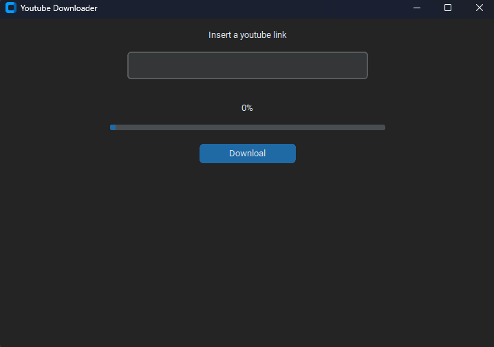

# YouTube Downloader

This project is a program to download YouTube videos using the [pytube](https://pytube.io/) library.

## Requirements

Make sure to install the following libraries before running the program:
- tkinter
- customtkinter
- pytube

You can install the libraries using pip:
```sh
pip install pytube customtkinter
